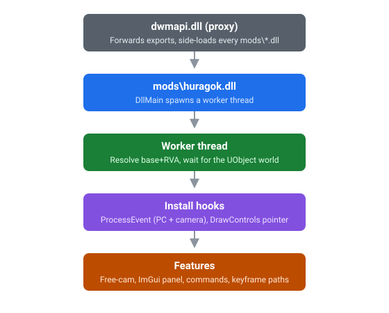

# Huragok

A Dear ImGui control panel injected into Halo: Campaign Evolved (UE 5.5.4). It loads
through a dwmapi proxy and puts single-player camera and gameplay controls behind an
in-game panel: a free-flying camera, FOV, and a handful of pawn tweaks.

Named after the Engineers from Halo, whose whole job is to take technology apart and
put it back together.


## How it loads



## Building

You need the Rust toolchain (MSVC) and the Visual Studio C++ build tools. `build.rs`
uses the latter to compile the small SEH shim in `csrc/`.

```powershell
cargo build --release
```

That produces `target\release\huragok.dll`. Drop it in the game's mod folder:

```
...\Halo Campaign Evolved\Meteorite\Binaries\Win64\mods\huragok.dll
```

Diagnostics go to a console window and to `huragok_log.txt` next to the game executable.

## Controls

`INSERT` toggles the free-cam. `WASD` plus `Space`/`Ctrl` fly, `Shift` goes faster,
mouse or arrow keys look, `Z`/`C`/`X` roll, `[` and `]` change FOV. `B` opens the
panel, where everything else lives. `K` adds a keyframe, `J` plays or stops the path,
`L` clears it.

## Layout

| Path | What it does |
|------|------|
| `src/lib.rs` | `DllMain` and the worker-thread bootstrap |
| `src/mem.rs` | module base, `base+RVA`, page patching |
| `src/offsets.rs` | RVAs and struct offsets for the current build |
| `src/seh.rs`, `csrc/seh.c` | `__try/__except` fault guard for reflected calls |
| `src/log.rs` | colorized console and `huragok_log.txt` (the `rep!` macro) |
| `src/input.rs` | keyboard polling and free-cam movement |
| `src/cmd.rs` | the command queue |
| `src/pawn.rs` | command executor: cheats, pawn FX, third-person body, scale, time |
| `src/paths.rs` | keyframe camera paths (Catmull-Rom) |
| `src/state.rs` | shared camera and toggle state |
| `src/hooks/` | camera, PlayerController, and ImGui hooks |
| `src/ue/` | UE reflection: `fname`, `object`, `reflect`, `process_event` |

## Features

| Component | Status |
|------|------|
| Free-cam (fly, look, roll, FOV) | Working |
| FOV override | Working |
| ImGui control panel | Working |
| Command queue and PlayerController hook | Untested |
| Cinematic mode and pause | Untested |
| Time dilation | Not working |
| Cheats (ghost, fly, god) | Not working |
| Pawn hide, collision, freeze | Untested |
| Scale (giant, tiny) | Untested |
| Third-person body | Untested |
| Pawn FX (camo, overshield, blood) | Untested |
| Keyframe camera paths | Untested |
| Live stats overlay | Planned |
| Keyframe timeline UI | Planned |
| Multi-window layout and charts | Planned |
| Console fixed input line | Planned |
